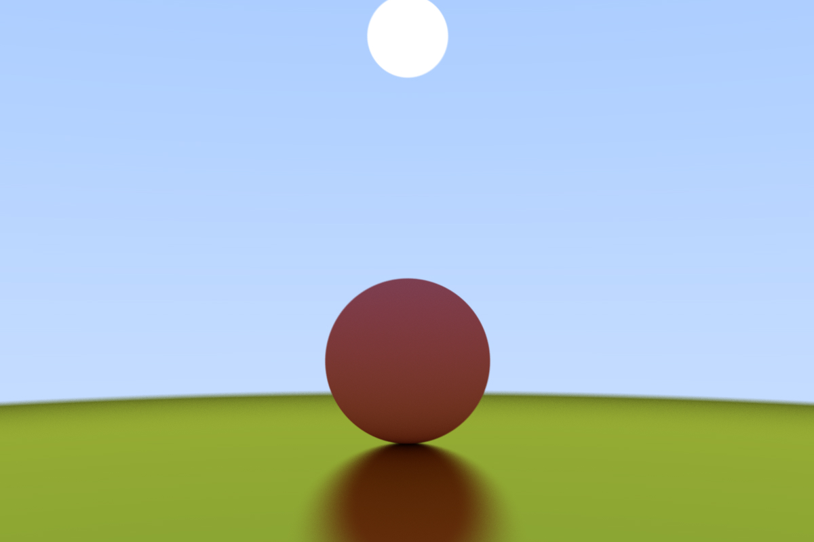
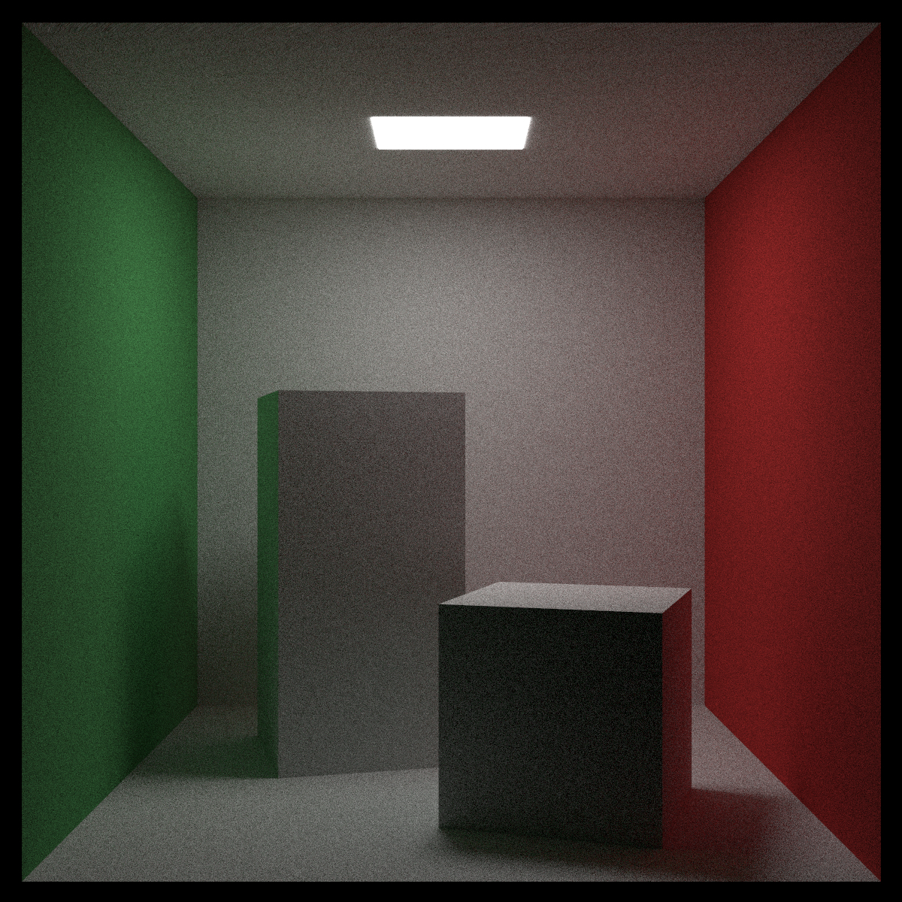
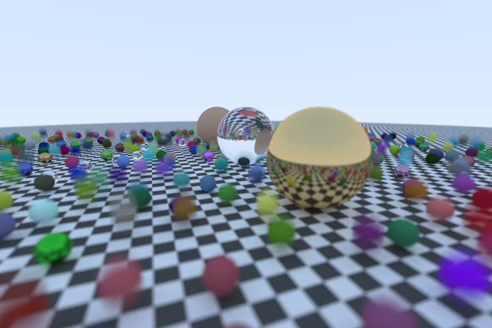

# CudaRT-OneWeekend

This repository contains the CUDA implementation of the ray tracer from the Ray Tracing in One Weekend series by Peter Shirley.  
It is (mostly) complete, with Monte Carlo bi-drectional path tracing and supports a variety of materials (lambertian, metallic, dielectric etc.).

It also features motion blur, depth of field, Perlin noise, BVH acceleration structures, and texture mapping.

It uses the stb_image library to save images into various formats.

## Images

| Scene | Image |
| :---: | :---: |
| Diffuse sphere on metallic sphere |  |
| Cornell box |  |
| Lots of spheres |  |

See more in the `samples` folder
